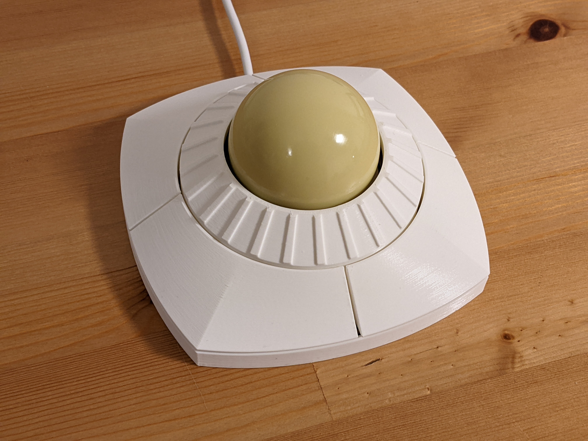
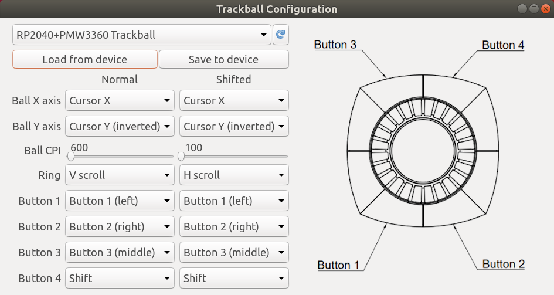
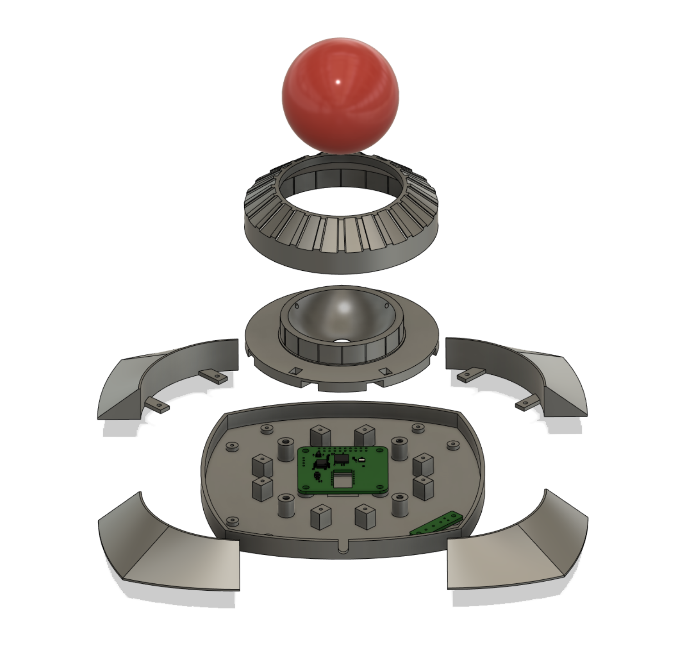
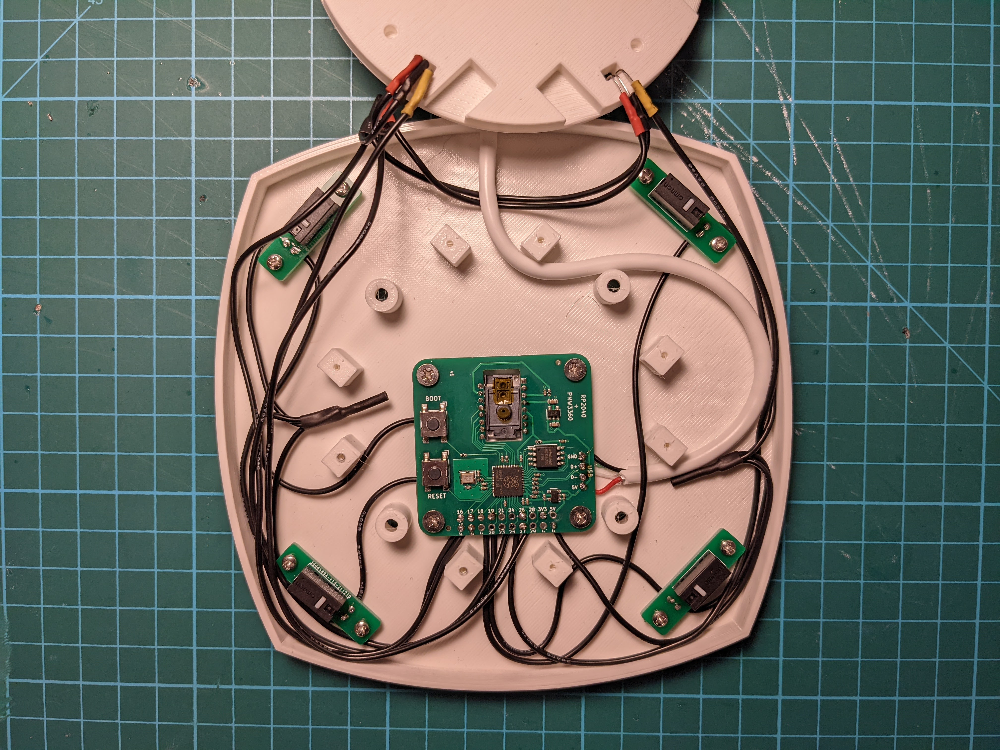
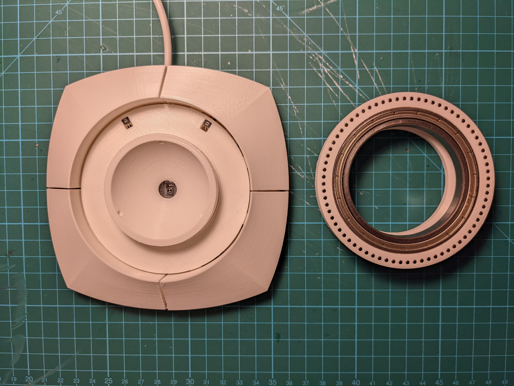

# DIY trackball with scroll ring

This repository contains design files and code that can be used to make a fully programmable four-button USB trackball with a scroll ring.

It uses the following components:

* 57.2mm billiard ball
* PMW3360 optical sensor
* [RP2040+PMW3360 PCB](https://github.com/jfedor2/rp2040-pmw3360)
* [button switch mount PCBs](https://github.com/jfedor2/mouse-switch-mount-pcb)
* [3D printed case](3d-models)
* Omron D2FC switches (or similar)
* 2x [SS49E Hall effect sensors](https://sps.honeywell.com/us/en/products/sensing-and-iot/sensors/magnetic-sensors/linear-and-angle-sensor-ics/ss39et-ss49e-ss59et-linear-sensor-ics) (TO-92 package)
* 72x 2x2mm neodymium cylinder magnets (axially magnetized)
* 60x78x10mm bearing (6812 ZZ)
* 2.5mm zirconium oxide (or silicon nitride) bearing balls
* M3x4 screws for mounting the main PCB and assembling the case
* M2x4 screws for mounting the buttons and the secondary PCBs
* USB cable (cut off the device end and solder the wires directly to the PCB)
* some hookup wire

The main PCB uses the RP2040 chip from Raspberry Pi. The firmware supports remapping of ball, button and ring functions using a configuration tool without the need to recompile the source code. All the configuration is stored on device, so the configuration tool is only needed to change the settings, not during normal use.

So far I only tested the configuration tool on Linux, but it should in theory run on Windows and Mac as well. I will try to provide ready-to-use packages in the future.

The provided [UF2 file](firmware/trackball.uf2) can be used to flash the firmware onto the device. When first connected, a "RPI-RP2" drive will show up and you flash the chip by copying the UF2 file to that drive. If you want to flash it again, hold the BOOT button and press the RESET button on the board.

I printed the case parts with 0.2mm layer height. They don't need supports.

The bearing and the magnets are press-fit into the case, but depending on your particular printer you might want to use glue. The Hall effect sensors should be oriented "face-up" and will definitely need some glue to stay in place.

The magnets should be installed with alternating polarity (the outside-facing pole should be N-S-N-S... etc.).

The Hall sensors' + leads are connected to 3.3V. The rest of the pin numbers are defined at the top of [trackball.cc](firmware/src/trackball.cc).

